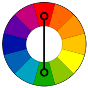

Colors that are opposite each other on the color wheel are considered to be complementary colors (example: red and green).

The high contrast of complementary colors creates a vibrant look especially when used at full saturation. This color scheme must be managed well so it is not jarring.

Complementary colors are tricky to use in large doses, but work well when you want something to stand out.

Complementary colors are really bad for text. 

Here's an example where providing a very simple texture to a bar chart will aid in readability and understanding for someone with decreased color perception.

<figure>
  

  <figcaption>Figure A: Chart without Texture</figcaption>

</figure>

<!-- Source: http://www.tigercolor.com/color-lab/color-theory/color-harmonies.htm -->